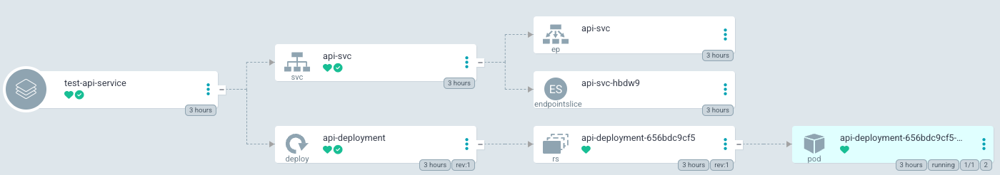

# Minikube 데모 
minikube k8s 상에서 운영되는 임의의 마이크로 웹서비스 개발 및 해당 CI/CD 파이프라인 구축하기

## CI/CD 파이프라인

## 웹서비스 개략도

## 'demo' 네임스페이스 구성
### k9s 서비스 XRay

### KubeView

## ArgoCD 대시보드
### 프로젝트 내 어플리케이션 리스트

### api 서비스 어플리케이션

### db 서비스 어플리케이션 

### AWS ECR 토큰 관리 어플리케이션

### frontend 서비스 어플리케이션

